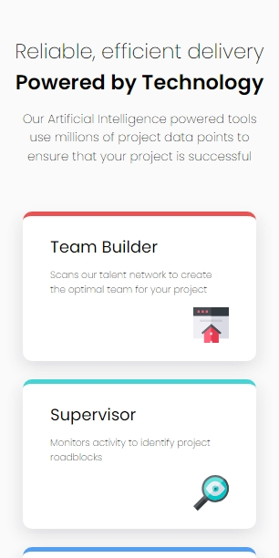
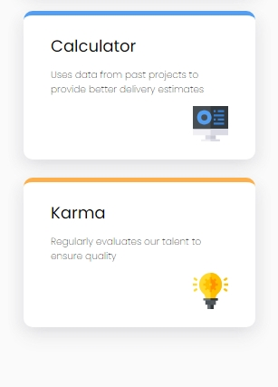
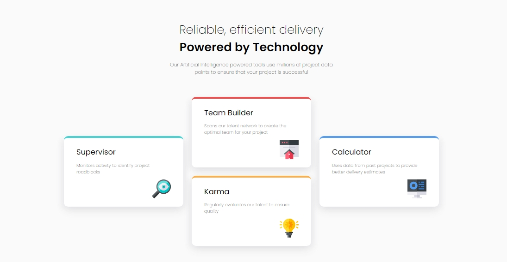

# Frontend Mentor - Four card feature section solution

This is a solution to the [Four card feature section challenge on Frontend Mentor](https://www.frontendmentor.io/challenges/four-card-feature-section-weK1eFYK). Frontend Mentor challenges help you improve your coding skills by building realistic projects. 

## Table of contents

- [Overview](#overview)
  - [The challenge](#the-challenge)
  - [Screenshot](#screenshot)
  - [Links](#links)
  - [Built with](#built-with)
  - [What I learned](#what-i-learned)
- [Author](#author)

## Overview

### The challenge

Users should be able to:

- View the optimal layout for the site depending on their device's screen size

### Screenshot






### Links

- Solution URL: [Add solution URL here](https://your-solution-url.com)
- Live Site URL: [Add live site URL here](https://your-live-site-url.com)


### Built with

- Semantic HTML5 markup
- CSS custom properties
- CSS Grid
- Mobile-first workflow

### What I learned


```html
<head>
    <meta charset="UTF-8">
    <meta name="viewport" content="width=device-width, initial-scale=1.0">
    <title> Four Card Feature Section </title>
    <link rel="stylesheet" href="style.css">
    <link rel="preconnect" href="https://fonts.googleapis.com">
    <link rel="preconnect" href="https://fonts.gstatic.com" crossorigin>
    <link href="https://fonts.googleapis.com/css2?family=Poppins:ital,wght@0,100;0,200;0,300;0,400;0,500;0,600;0,700;0,800;0,900;1,100;1,200;1,300;1,400;1,500;1,600;1,700;1,800;1,900&display=swap" rel="stylesheet">
    <link rel="icon" type="image/png" sizes="32x32" href="./images/favicon-32x32.png">
</head>
```
```css
.container {
    display: grid;
    width: 100%;
    gap: 20px;
    grid-template-columns: 1fr 1fr 1fr 1fr 1fr 1fr;
    grid-template-rows: 1fr 1fr 1fr 1fr;
}

.top-card {
    padding: 20px 30px;
    border-top: 5px solid hsl(0, 78%, 62%);
    border-radius: 10px;
    background-color: white;
    grid-column: 3 / 5;
    grid-row: 1 / 3 ;
    box-shadow: 
    0px 10px 20px hsl(234, 12%, 34%, 0.1),  /* Lower part shadow */
    -10px 5px 10px hsl(229, 6%, 66%, 0.05), /* Left part shadow with 70% opacity */
    10px 5px 10px hsl(229, 6%, 66%, 0.05);  /* Right part shadow with 70% opacity */
}
```

## Author

- Website - [Kelvin Ahante](https://www.kelvinahante.com)
- Frontend Mentor - [@kiviekelvin](https://www.frontendmentor.io/profile/kiviekelvin)
- Twitter - [@D1Mysticity](https://x.com/D1Mysticity)
